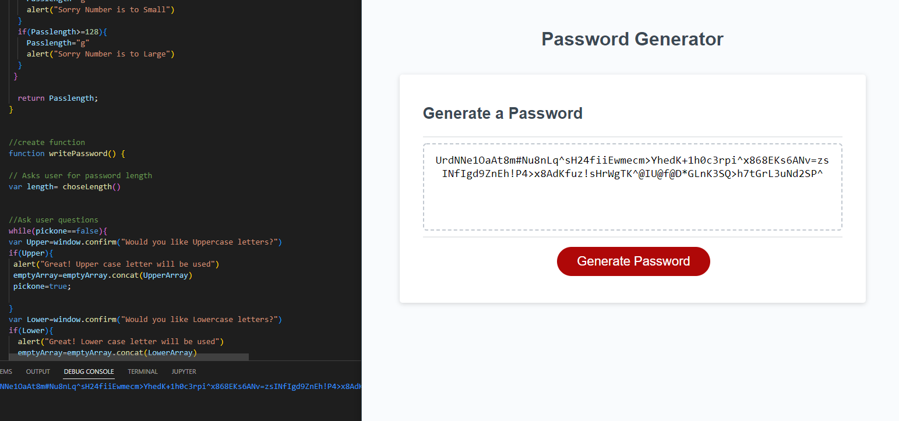

# Module-Challange-3
## This is challenge three for UoM JavaScript: Password Generator
For this weeks challenge I was tasked with creating an application that a employee can use to generate random passwords, based off of a criteria set by the employee.

- The motivation behind this project was to become more familiar with JavaScript and learn how to create functions, use various methods of validation and learn how to create
a password generator based off an employees prefrences. 

- I built this project to further my understanding of JavaScript and practice what I have learned in class. Creating this password generator I was able to dive deeper into the different kind of loops I can use to complete a task and try out various .  

- This project resolves having a built in browser password generator that creates a unqiue password based of of how the user interacts with the prompts. By asking the user yes or no questions we can the create a password with elements such as upper case letter and numbers. Once the user has finished answering the questions a distinct password is generated.   

- Completion of this project allowed for me to become more knowledgeable on JavaScript elements and completion of a online password generator while fulfilling a possible clients needs.  

# Installation
In order to install my project you will need the following

- Git
- IDE with HTML/CSS capabilities 

To start: 
Clone the repository on GitHub then open Git on your local machine. First find a location of your choice on your computer that you want the folder to be in.
- To change working directory, use the command cd followed by a folder or cd.. to move back  
- Using the command git clone and adding the cloned directory, you will have a copy of this project
- To deploy to your ide type code. 

# Usage 
The purpose of this project is to fulfull a clients need for an online accessable password generator.  

